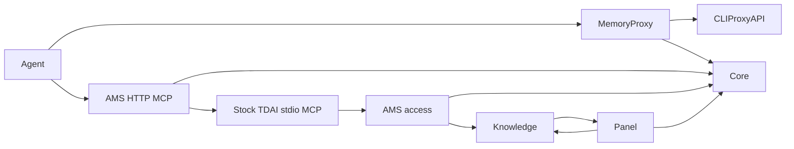

# 🧠 Agent Memory Stack

**Your AI subscription, with a memory stack you run yourself.**

Agent Memory Stack (AMS) brings TencentDB Agent Memory together with CLIProxyAPI and a remote MCP server. Give your coding agent persistent memory, reusable skills, and access to project knowledge while using your existing model accounts. Run the stack on your laptop or a VPS, and keep working in Codex, Claude Code, or another compatible agent.

**Built with:**

- [TencentDB Agent Memory (TDAI)](https://github.com/TencentCloud/TencentDB-Agent-Memory) — memory, skills, Wiki, CodeGraph, MemoryProxy, and the web panel.
- [CLIProxyAPI](https://github.com/router-for-me/CLIProxyAPI) — connects your AI accounts and subscriptions to the stack's models.
- [MCP TypeScript SDK](https://github.com/modelcontextprotocol/typescript-sdk) — connects the Knowledge stdio MCP server to the AMS authenticated Streamable HTTP endpoint through its standard transports.

## ✨ What you get

- **Memory across conversations.** Keep project decisions, preferences, and useful context in your own stack. MemoryProxy brings relevant memory into the agent's model requests.
- **Reusable skills.** TencentDB Agent Memory extracts and manages skills, and MemoryProxy supplies relevant skill instructions to your agent. This adds part of the agent harness around the coding tool you already use.
- **Wiki and CodeGraph.** Turn documents into project knowledge and explore indexed code through TencentDB's Knowledge tools.
- **Your model accounts, connected.** CLIProxyAPI connects the agent's model requests to supported providers. AMS includes account login for ChatGPT (Codex) and Claude.
- **MCP that can live on your server.** Connect to Knowledge over authenticated Streamable HTTP. The stdio bridge runs inside the stack, so your agent connects with an MCP URL and a user key.

## 🔗 Bring your subscription and choose your memory models

The core idea is simple: **combine TencentDB's memory and knowledge with the model access you already have.** Every installation runs all six services—Core, Knowledge, Panel, MemoryProxy, CLIProxyAPI, and MCP—in one Compose project, with a web panel for users, keys, and resources.

| Models for memory and Knowledge | How it fits |
| --- | --- |
| **Use this stack's CLIProxyAPI** — default for a fresh full stack | Reuse your signed-in model account for agent inference, memory processing, and Knowledge; no extra API address or key to enter |
| **Connect another model API** — optional | Supply a separate API base URL and key for Core and Knowledge while the agent continues through CLIProxyAPI |

Choose the Core memory model and Knowledge model independently in either mode. Your agent still chooses its own model. Sharing CLIProxyAPI shares account capacity; choosing a separate external API keeps internal processing on that provider. The account-login menu offers ChatGPT (Codex) and Claude.

With the default local route, setup can save configuration before Docker/Podman is running. Configure collects both model names. Apply uses the saved files and completes account login if needed; it never asks for or fills model choices. Cancel and run `ams apply` later to resume with the saved settings and completed login. Existing installations keep their explicit external settings until you choose the shared route.

## 🗺️ How it fits together



All six applications run together. Core and Knowledge use either CLIProxyAPI or your configured external model API. The [architecture guide](docs/architecture/README.md) maps the current services, configuration lifecycle, and MCP boundary.

AMS runs the selected TDAI revision unchanged, including upstream defects. In the pinned revision, Proxy user verification omits the service Bearer required by Core; model requests can fail even when all containers are healthy. See [validation](VALIDATION.md).

## 🧩 Two connections for your agent

**MemoryProxy is the model API with memory. MCP is the connection to Knowledge tools.** You can configure either one or both.

| | MemoryProxy | Knowledge MCP |
| --- | --- | --- |
| What it gives the agent | Memory context and skill instructions around model requests | Tools for Wiki and CodeGraph resources |
| What you configure | The agent-specific Base URL and API key from Panel | A Streamable HTTP server at `/mcp` and a memory-user key |
| Where to connect | The local MemoryProxy port or your reverse-proxy domain | The local MCP port or your reverse-proxy domain |

On the same machine, use localhost. For a VPS, put Caddy in front of the published ports and use your HTTPS domains. Panel, MemoryProxy, and MCP bind to localhost by default; you decide how to make them reachable remotely.

AMS runs the MCP HTTP-to-stdio bridge on the server and checks the caller's user, team, and resource permissions. Your agent connects directly over HTTP, without a local bridge process. You keep control of the agent's configuration.

## 🚀 Start setup

### Prerequisites

- **Node.js 24+ with npm** to install and run `ams`.
- **Docker with Docker Compose**, or **Podman** with configured `podman compose`, `podman-compose`, or `uvx podman-compose`.
- **`tar` on `PATH`** to unpack the verified TDAI source archive and offline bundles.
- **Outbound internet access for the default first setup and image build** to download the npm package, TDAI source, container base images, and build dependencies. A prepared offline bundle covers the TDAI source and images after AMS itself is installed.
- **An active ChatGPT (Codex) or Claude account with access to the selected models** when using the stack's CLIProxyAPI. External mode instead requires a compatible API base URL, API key, and models. Account login needs a browser on any machine that can open the displayed URL; a VPS needs no local browser or inbound callback port.

```sh
npm install -g agent-memory-stack
ams
```

1. Choose **Configure stack**, select your CLIProxyAPI account provider and model source, then enter separate Core/Knowledge model names. An external model API can also supply a list to choose from.
2. Apply the saved files. AMS starts the stack without asking for model choices; save the administrator key for a new Core and complete account login when required.
3. Choose **Show connection details** to find Panel, MemoryProxy, and MCP. Open Panel to get your agent’s Base URL and user API key.

The first Configure downloads a verified TDAI source archive to obtain native templates, or reuses an existing archive/offline bundle. Saving needs no engine. The first image build also downloads dependencies. Editable TDAI files live in `~/.config/agent-memory-stack` (or the saved absolute XDG configuration root). Runtime `.env`, `compose.yaml`, `.ams/`, and the default `./data` stay in `~/.agent-memory-stack`; edit `DATA_DIR` in runtime `.env` to change the data path.

For later changes, edit [native configuration](docs/native-configs.md) or AMS orchestration `.env`, then run `ams apply`. To update TencentDB Agent Memory, run `ams update tdai`: AMS replaces `defaults/`, preserves `overrides/`, and checks document structure. All configured values belong to you, including defaults and empty values; AMS does not validate them or fill missing models during Apply. MemoryProxy administration uses its own persistent native `admin.apiKey`.

The configuration layout is:

```text
~/.config/agent-memory-stack/
  defaults/                  # five original templates from the selected TDAI archive
  overrides/                 # your native service settings
~/.agent-memory-stack/
  .env                       # AMS ports, data path, provider and helper settings
  compose.yaml               # generated by Apply
  .ams/                      # source/image records and configuration snapshots
  data/                      # persistent service data, unless DATA_DIR is changed
```

AMS leaves TDAI source and dependency manifests unchanged. The MCP gateway uses the official SDK to connect each authenticated HTTP POST to an isolated stock stdio process, closed with its response. Third-party source metadata lives in `vendor/`; Dockerfiles live in `deploy/`; AMS and its gateway share the root dependency lock.

## 📚 Guides

| Guide | What you will find |
| --- | --- |
| [Setup and operations](https://github.com/shura-v/agent-memory-stack/blob/main/docs/operations.md) | Configuration, provider login, Caddy, MCP connections, and recovery |
| [Connect Codex, Claude Code, and Hermes](https://github.com/shura-v/agent-memory-stack/blob/main/docs/agent-profiles/README.md) | CLI launch profiles for MemoryProxy and commands to add Knowledge MCP |
| [Publish through Caddy](https://github.com/shura-v/agent-memory-stack/blob/main/docs/caddy.md) | HTTPS domains for Panel, MemoryProxy, and MCP; private backend services |
| [Updating TDAI](https://github.com/shura-v/agent-memory-stack/blob/main/docs/updating-tdai.md) | Update the upstream services on your installation |
| [Native configuration](docs/native-configs.md) | Defaults, overrides, public URLs, credentials, and update behavior |
| [Architecture](docs/architecture/README.md) | Current service, configuration, and MCP diagrams |

## 🧑‍💻 For developers

Working on AMS itself? Start with the [development guide](https://github.com/shura-v/agent-memory-stack/blob/main/docs/development.md) for running from source, checking changes, and building a local npm package.

AMS is written in TypeScript. The [validation notes](https://github.com/shura-v/agent-memory-stack/blob/main/VALIDATION.md) distinguish automated checks from live container and provider acceptance; the [defaults audit](https://github.com/shura-v/agent-memory-stack/blob/main/DEFAULTS-AUDIT.md) explains configuration differences from upstream.
