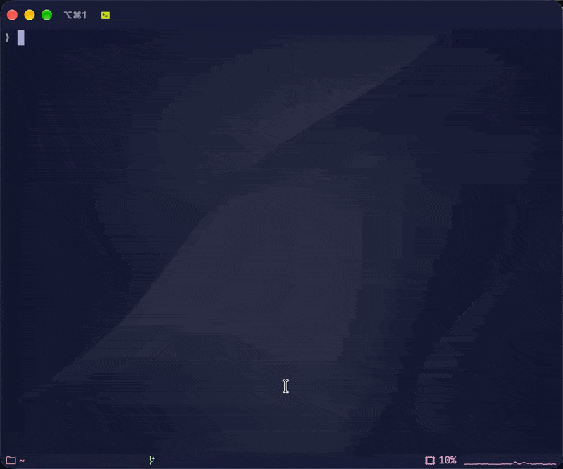

# Stack setup and operations

For an overview and a quick start, see the [README](../README.md). For source builds and contributions, see [Development](development.md).

## 🚀 1. Start setup



Install Node.js 24+ and npm to configure the stack. Server application also requires Docker or Podman with Compose. Fresh installations use the pinned sources in the packaged `upstream.lock.json`; a separate TencentDB checkout is unnecessary.

To update TDAI on this server, run `ams update tdai`. It downloads the latest `feat/server_team` revision and rebuilds/applies the saved installation. The selected revision lives in its `.ams/tdai-source.json`; the npm package is unchanged. See [Updating TDAI](updating-tdai.md).

```sh
npm install -g agent-memory-stack
ams
```

The menu offers **Configure stack**, **Apply configuration**, and **Show connection details**. Start with **Configure stack**. If a complete installation is already visible, AMS identifies its runtime configuration and available native configuration location. Use **Apply configuration** for later changes to the fixed configuration folder. Otherwise, follow the setup questions. The wizard saves configuration, then asks **Apply configuration now?**, with **Yes** selected. **No** exits successfully and keeps the saved configuration. **Yes** applies it immediately. Apply later by choosing **Apply configuration** in the menu or running the standalone command, without repeating setup questions. Choose Core and Knowledge models in Configure stack. Apply reads and applies the saved files without model discovery, model questions or checks that model fields are filled:

```sh
ams apply
```

**Wizard controls:** Escape returns to the previous question; Ctrl+C cancels. Confirmed answers are restored when revisiting a question; changing an earlier answer clears dependent answers. Press Enter on a saved secret field to keep its value. Escape on the first menu exits. Back navigation ends when configuration is saved; declining immediate application keeps your saved settings for later.

From this checkout, use `npm run dev -- apply`. Configure, apply, `ams update tdai`, and **Show connection details** always use `~/.agent-memory-stack`, resolved from the current OS user's home directory. The runtime folder contains orchestration `.env`, `compose.yaml`, and `.ams/`. Editable TDAI files use `~/.config/agent-memory-stack` or an absolute `$XDG_CONFIG_HOME/agent-memory-stack`; the saved native-root reference remains authoritative. The calling directory and XDG settings do not move runtime data or change Compose identity. There is no configuration-directory prompt, public directory flag, or `targets.json` pointer.

Server apply verifies the saved Compose provider before building images or proceeding with application. It then checks local image identities and build-input fingerprints, builds missing or outdated images, resolves published ports in the selected engine, saves the chosen ports, checks native document structure and provenance, prepares a read-only configuration snapshot, and recreates containers. The first build downloads pinned sources, base images, and dependencies. The wizard manages `.ams/images.json` automatically; you do not need to supply it. Changing orchestration `.env` or native service files does not require rebuilding unchanged images. Updating packaged code or image build inputs triggers a cached rebuild before services stop; matching images loaded from a bundle remain reusable offline.

`ams apply` remains available after installation. Once local Core is healthy, apply checks whether it already has an active administrator. Existing administrators keep their keys, even when an earlier attempt started only part of the stack. If Core reports that initial setup is required, AMS automatically generates an administrator key, prints it, and asks you to save it before initialization. There is no generate/manual choice. Other check failures stop application without generating or replacing credentials.

Saved desired configuration remains available if application fails. Image preparation or preflight failures leave runtime configuration and running application containers unchanged. Downloaded sources and build cache can remain for a retry. In shared local-model mode, CLIProxyAPI may already be running after an interrupted authorization stage; completed login remains available for retry. Model values come directly from the saved configuration, and native services determine whether they are usable. Saving configuration alone needs no container engine or administrator key.

### Optional: prepare images on another machine

For offline delivery or building on a different host, prepare a [development checkout](development.md#run-from-a-checkout), then use the build/export/load workflow:

```sh
npm run build
npm run build:images -- --runtime podman --platform linux/arm64 --project-dir ./delivery
npm run build:images -- --runtime podman --project-dir ./delivery --export ./images
npm pack
```

For an x86 VPS, build `linux/amd64` images with a compatible builder. Setup checks the actual container engine architecture before initialization. The build produces six application images (including MCP) and one runtime image for support containers. Apply and offline delivery always require this complete seven-image set.

Distribute the npm archive and image bundle separately. Export includes `images.tar`, `images.json`, `bundle.json`, `tdai-source.json` and the verified TDAI source archive. Import checks source and image checksums, platform and revision before saving pending inputs. Configure extracts the five originals into flat `defaults/`; no template tree is packaged in AMS or the bundle. Operator overrides and secrets stay outside the bundle.

On the destination machine:

```sh
npm install --global ./agent-memory-stack-0.1.0.tgz
node "$(npm root -g)/agent-memory-stack/dist/build/cli.js" --runtime docker --project-dir "$HOME/.agent-memory-stack" --load ./images
ams
```

Use `--runtime podman` for Podman image operations. In setup, select Docker Compose, configured `podman compose`, `podman-compose`, or `uvx podman-compose`. Shell aliases such as `docker=podman` are not used. Load images into `~/.agent-memory-stack`; verified images are reused. Container startup itself does not compile applications. These commands do not publish to npm or a registry.

`Podman compose (configured provider)` requires an external Compose provider already configured for `podman compose`. If only Podman and uv are installed, select **Podman + uvx podman-compose**. An unavailable provider now fails before image builds, with instructions for the selected provider.

## ⚙️ 2. Configure the local stack

AMS orchestration `.env` lives beside `compose.yaml` in `~/.agent-memory-stack`. Complete upstream defaults and partial native overrides live in the separate saved native root, normally `~/.config/agent-memory-stack`. `ams apply` reads both from any working directory. See [native configuration](native-configs.md) for file ownership, service settings, literal credentials, recovery, and override validation. `deploy/` contains image build files.

After you choose **Configure stack**, and before any configuration question, setup inspects the current user's available Docker and Podman endpoints read-only. The initial menu is always shown; opening it alone does not trigger detection. All six application service labels must belong to one exact AMS Compose project in one engine. Support/init containers do not count; stopped application containers do. When the group is complete, output points to its `.env` using the project working-directory label if available and exits successfully. No credentials or configuration files are read by this check.

This detects ordinary repeated setup; it does not enforce uniqueness across inaccessible contexts, deleted/partial stacks, concurrent invocations, or other accounts. If no complete group is visible, setup continues, including save-only operation without a running engine. It creates no registry or lock and repairs nothing automatically.

Run `ams` and choose **Configure stack**. Runtime configuration goes into `~/.agent-memory-stack` and native service files into the saved native root without a directory question. Relative data paths such as `./data` resolve inside that folder. Every installation includes all six application services:

| Service | Purpose |
| --- | --- |
| Core | Memory storage, users, and permissions |
| Knowledge | Wiki and document processing |
| Panel | Web interface for managing the stack |
| MemoryProxy | Adds memory context to agent requests |
| CLIProxyAPI | Provides API access to supported AI providers |
| MCP | Exposes protected Knowledge tools over Streamable HTTP |

Three support containers are included automatically: `config`, `bootstrap`, and `access`. The wizard displays the full stack and asks no service-selection, dependency-placement, stack-address, port, or interface-enablement questions. All services run together in this installation.

The remaining questions cover the Compose provider, CLIProxyAPI account provider, internal model source, memory prompt mode, and log level. The CLIProxyAPI account provider question comes before **Models for memory and Knowledge**. The wizard automatically reuses saved Core and CLIProxyAPI service keys and generates missing local keys without questions. Native TDAI credentials are owned by their override files; CLIProxyAPI and AMS helper credentials remain in orchestration `.env`. Administrator handling happens during application. Native service values are operator-owned. AMS checks document structure and provenance; TDAI loaders and runtime checks determine whether edited service connections work.

`DATA_DIR` defaults to `./data`, relative to the Compose configuration directory. Setup retains an existing saved value exactly and asks no **Data directory** question. Change the data path manually in `.env`; the configuration folder itself stays fixed.

### Models for memory and Knowledge

For a fresh installation, **Use this stack's CLIProxyAPI** is selected initially. The other choice is **Connect another model API**. Core and Knowledge keep separate model settings in both modes; the agent selects its own inference model.

| Setting | Shared CLIProxyAPI | Separate external API |
| --- | --- | --- |
| `INTERNAL_LLM_SOURCE` | `cliproxy` | `external` |
| Initial API base | `http://cli-proxy-api:8317/v1` inside Compose | External base saved in Core `llm.baseUrl` and Knowledge `LLM_BASE_URL` |
| Initial credential | Current `CLIPROXY_API_KEY`, initially written to overrides | External key saved in Core `llm.apiKey` and Knowledge `LLM_API_KEY` |
| Native model fields | Core `llm.model` and Knowledge `LLM_MODEL`, entered during Configure stack | The same separate fields, selected during setup |

Local mode asks for no internal API address or key and needs no extra host listener. Changing the CLIProxyAPI service key requires corresponding consumer edits for working authentication; apply preserves native overrides and runtime authentication exposes mismatches. Core, Knowledge, and agent inference share account capacity but can use different models.

Existing settings without `INTERNAL_LLM_SOURCE` retain `external` behavior, including a manually entered local proxy URL and key. AMS does not infer ownership from URL equality. To opt in, set `INTERNAL_LLM_SOURCE=cliproxy`, update both consumers’ native endpoint/key overrides to match CLIProxyAPI, then apply. Existing model IDs stay unchanged. For external routing, configure the native API base and key in each consuming service file; a source switch preserves explicit overrides and passes their values to the services.

**Memory prompt mode** controls what Core extracts and summarizes from conversations. Choose **code** (the default) for project decisions, technical constraints, and reusable team practices; choose **chat** for personal preferences, events, and lasting instructions. This changes Core's memory prompts, not the model used to answer agent requests.

Output-token limits and LLM timeouts are configured in native service files. The wizard does not ask for them. Fresh files inherit the selected template values. The deployment defaults map to these native fields:

| Setting | Stack default |
|---|---|
| Core `llm.maxTokens` | Template default |
| Knowledge `LLM_MAX_TOKENS` | `32768` |
| Core `llm.timeoutMs` | Template default |
| Knowledge `LLM_TIMEOUT_MS` | `1200000` (20 minutes) |

Core uses the full native `tdai-gateway.yaml` template and Knowledge uses `.env.example` from the selected revision. Their saved native values remain authoritative; newer untouched template defaults can be adopted during an update.

### Complete local installation

**Shared CLIProxyAPI:** Configure stack asks for the Core and Knowledge model names and saves them in their native overrides. This needs no running engine or provider login. Apply uses those saved values and performs no model discovery, replacement, prompting or nonempty-model enforcement. To change model names, edit their overrides or use Configure stack when available.

**External API:** setup asks for the real API base and key, then requests `GET /models` from the CLI host. An explicit HTTP 401/403 asks for a corrected external key. The local route instead reports a proxy authorization or service-key failure; it does not ask for an unrelated external credential.

External model discovery during Configure stack is best effort, bounded to five seconds, with manual model entry when the list is empty or unavailable. It does not send an inference request. Panel does not overwrite the Core or Knowledge model bindings.

1. Choose **Configure stack**, select the Compose provider, then choose your CLIProxyAPI account provider before **Models for memory and Knowledge**.
2. Review and save. **Apply configuration now? → No** keeps settings for later without an engine; **Yes** applies immediately.
3. Apply uses the saved files. In shared local mode, it prepares CLIProxyAPI and reuses saved authorization or completes login before starting the remaining services. Model questions stay in Configure stack.
4. For a new Core, save its generated administrator key and confirm **OK**. When services are ready, choose **Show connection details** to open Panel and configure your agent. External mode retains its normal account-login stage.

### Automatic ports

Panel prefers port `8123`; MemoryProxy prefers `8096`; MCP prefers `8425`. Apply first tries the saved preferred ports through the selected Docker/Podman engine. It reuses listeners owned by the same installation and selects free alternatives for conflicts with unrelated listeners. The resulting ports are saved in `.env` and printed after application. Every published listener remains bound to `127.0.0.1`.

Saving alone does not probe ports or require an engine. First allocation fills pending local origins in native overrides. Later port changes preserve explicit origins and report the required native/Caddy adjustments. Container-to-container addresses and provider API prefixes remain unchanged. A failed application retains retryable desired settings without claiming that services started.

Knowledge, Core, and CLIProxyAPI have no default host entry points. Knowledge's protected tool gateway remains available inside Compose. MCP uses this internal gateway without publishing it to the host.

### VPS and Caddy

Follow [Publish the stack through Caddy](caddy.md) for separate HTTPS domains, loopback upstreams, and connection checks. You choose which ports and services to expose; AMS does not configure your firewall or add Caddy route restrictions.

### CLIProxyAPI account login

CLIProxyAPI supports several AI providers and API formats. Setup asks which account to configure: **ChatGPT (Codex)** or **Claude**. The choice is stored as `CLIPROXY_AUTH_PROVIDER=codex` or `claude`; an absent value defaults to `codex` for compatibility. On an existing installation, change it in `.env` and run `ams apply`.

Apply uses the provider saved in `CLIPROXY_AUTH_PROVIDER` without asking you to choose again. This also applies when you answer **Yes** to **Apply configuration now?** in the wizard. A matching, non-disabled record with an access or refresh credential skips login; otherwise, apply starts authorization for the saved provider. Credentials from another provider and a nonempty model list do not count as authorization for the selected provider. The check reads the authorization directory through a read-only helper with networking disabled; read/runtime failures are reported instead of treated as missing login. Saved credentials do not prove token freshness or inference access.

| Selected account | Browser and terminal steps |
| --- | --- |
| ChatGPT (Codex) | `-codex-device-login -no-browser`: open the displayed verification URL on your computer and enter the device code. |
| Claude | `-claude-login -no-browser`: sign in through the displayed URL, then copy the **complete final localhost callback URL**, including its query. The browser may show connection refused. The terminal asks for this URL after **15 seconds**; paste it there and submit. **Do not press Enter on an empty prompt.** |

The VPS needs no browser or inbound callback port. OAuth files stay in `data/cli-proxy-api/auth`. The local service stops for login so only one process refreshes its tokens. After login, AMS checks for the selected provider's saved credentials again: a zero process exit alone does not mean authorization succeeded. Selecting an account provider affects account setup only; it does not change model routing or delete other providers' authorization.

MemoryProxy reaches local CLIProxyAPI over Compose. Advanced direct consumers can enable `CLIPROXY_SERVICE_ENABLED=true` in `.env`; its preferred loopback port is `8317`. Such consumers use the CLIProxyAPI service key and the appropriate provider API route. Direct CLIProxyAPI access does not add memory or Knowledge tools.

### Published interfaces and native connections

All services use the installation’s Compose network for stack dependencies. Core and Knowledge may use either the local CLIProxyAPI or a separate external model API. Host publication remains configurable independently of the fixed service composition.

Set a service's `*_SERVICE_ENABLED=true` flag to publish its authenticated loopback interface for operator-managed forwarding. To expose direct Knowledge HTTP tools, separately set `KNOWLEDGE_TOOLS_PUBLIC_ENABLED=true` and an agent-reachable origin in `overrides/knowledge.env` at `KNOWLEDGE_PUBLIC_URL`. A saved port or origin alone does not enable publication. Use the actual allocated ports printed by apply.

Container addresses differ from agent/browser origins: `localhost` inside a container refers to that container. Native overrides own service connection settings, while runtime `.env` owns host-port publication. The initial agent/browser origins contain no credentials, API path, query, or fragment; subsequent native origin edits are passed through without an AMS semantic check. Copy the agent-specific MemoryProxy endpoint path from Panel; direct Knowledge HTTP tools use one `/v3` prefix. HTTPS certificate verification remains enabled for external connections.

| Published interface | Default loopback port | Audience and authorization |
| --- | --- | --- |
| MemoryProxy (agent API) | `8096` | Agent requests with memory-user and session authorization |
| Knowledge HTTP tools, explicitly enabled | `8422` | Memory-user key, active membership, and asset access checks |
| Panel (web interface) | `8123` | Browser/user interface; authenticated service callbacks share this listener |
| MCP | `8425` | Streamable HTTP `/mcp`; a memory-user Bearer key on every request |
| Core service, explicitly enabled | `8420` | Trusted service consumers using the Core service key |
| CLIProxyAPI service, explicitly enabled | `8317` | Model API consumers using its service key; management routes remain disabled |
| Knowledge service, explicitly enabled | `8423` | Native Knowledge listener on container port 8421; stock tenant-header behavior |

Every binding is `127.0.0.1`. These are preferred ports, not guaranteed final assignments. Fresh defaults publish Panel, MemoryProxy and MCP. Panel connects directly to native Knowledge over Compose. The optional public Knowledge tool endpoint belongs to the AMS access gateway and enforces user/resource authorization. The separately enabled native Knowledge listener uses stock authentication behavior.

## 🔑 3. Credentials, settings, and agent connections

Orchestration settings live in `<installation>/.env`; TDAI service settings live in the linked native directory. The six application services always run locally. `*_SERVICE_ENABLED` controls optional service listeners; `*_SERVICE_PORT` sets preferred ports. `KNOWLEDGE_TOOLS_PUBLIC_ENABLED=false` keeps direct Knowledge HTTP tools private by default.

Local service keys are generated during initial setup and reused later. Core's credential belongs to `overrides/core.yaml` at `server.apiKey`; CLIProxyAPI's credential remains `CLIPROXY_API_KEY` in orchestration `.env`. All five native configurations are initialized together and composed from current defaults and overrides. Native and orchestration values, including host/service ports, DATA_DIR, provider choices, paths, URLs, models and credentials, pass through without AMS value-policy validation. Malformed document syntax and deletion instructions still fail explicitly; AMS still resolves collisions through actual runtime port allocation.

Generated keys use `sk-ams-admin-…`, `sk-ams-core-…`, and `sk-ams-cliproxy-…`, with 32 independently generated random bytes encoded as hex. The administrator key is generated automatically only when local Core needs initial setup, displayed before initialization, and passed to bootstrap through stdin. It is not added to `.env`, a separate admin-key file, command arguments, or container environment variables. Core persists its credential database. Save the displayed key yourself; applying an already initialized Core preserves its administrator key without requesting it again.

Double-quoted `.env` values use JSON escaping: `\\` represents a backslash, `\"` represents a quote, and `$` stays literal. Derived `.ams/compose.env` contains only image IDs, paths, and ports. The exact upstream defaults plus partial user overrides determine service settings; generated runtime snapshots contain their effective composition. Native env files use the stock dotenv parser, including its quoting and escape behavior; see [native configuration](native-configs.md).

Edit the owning native service file or orchestration `.env`, then apply it with:

```sh
ams apply
```

Apply reloads current settings and the saved Compose provider, checks document structure/provenance and snapshots native documents, refreshes Compose, and recreates the full stack as needed. Native manual edits remain authoritative, including fields originally populated by setup. A plain container `restart` does not apply changed configuration. Edit publication and advanced networking through the recognized `.env` fields directly. Generated `compose.yaml` and `.ams/compose.env` are refreshed by application. Cancellation before saving leaves previous settings intact; declining application after saving keeps the new desired settings without touching running containers.

MemoryProxy has a separate native administrative secret in `overrides/proxy.yaml` at `admin.apiKey`, generated initially as `sk-ams-proxy-admin-…` using 32 random bytes. It is preserved across apply/update. Later native key edits, including empty or deleted values, are operator-owned and do not trigger validation or reseeding by AMS. Native routes such as instance destruction check that key themselves. AMS adds no guard or route allowlist to TDAI. With the independently generated admin key, ordinary user keys cannot pass that native admin check. This does not add ownership checks to upstream session handlers that do not use `checkAdminAuth`. See [native administration](native-configs.md#native-proxy-administration).

Custom native API prefixes and listener changes are passed to TDAI without rewriting Compose ports, helper routes or readiness paths. Helpers still use `/v3`; configuration acceptance is not a claim that a custom prefix works end to end. Standalone configuration check reads the composed installation, checks document integrity and provenance, leaving value acceptance to native loaders and actual runtime execution.

### Knowledge MCP

Use `http://localhost:<MCP_PORT>/mcp` on the service host, or your Caddy HTTPS domain with `/mcp` from another computer. The saved `.env` contains the actual allocated `MCP_PORT`; apply also prints it. Authenticate with `Authorization: Bearer <memory-user-key>` using the intended user key from Panel. Core service keys are not MCP user credentials. Administrator user keys retain their native administrative permissions.

The MCP server runs the selected TDAI stdio implementation: `wiki_search`, `wiki_read`, `wiki_list`, `wiki_graph`, `code_search`, `code_explore`, `code_callers`, `code_callees`, `code_impact`, `code_node`, `code_status` and `code_files`. Obtain the Wiki or CodeGraph resource ID from Panel and use the schemas returned by `tools/list`. The external AMS access boundary checks active user status, resource type, asset access and team membership before adding the required service header and forwarding the native request.

The authenticated boundary verifies the caller on every HTTP request, including session streams and teardown. Supergateway workers are isolated by credential and bound to container loopback. The deployment keeps at most eight workers, with eight concurrent sessions per worker and five-minute idle expiry. User keys exist only in live request/worker memory and private child environments; they are not written to installation configuration. Restarting MCP ends its sessions and does not affect Knowledge or Core data.

The connection-information action reads the resolved `MCP_PORT` from saved `.env`; `.ams/compose.env` carries that port for Compose. MCP is always part of the stack and reaches Core and the protected Knowledge gateway through Compose. It needs no stored user token, domain, or client JSON profile.

<details>
<summary>How the bridge differs from upstream stdio and direct HTTP tools</summary>

The upstream Knowledge MCP server uses stdio. AMS executes its unchanged compiled entrypoint behind Supergateway with native `KNOWLEDGE_API_URL`, `KNOWLEDGE_API_TOKEN` and `LOG_LEVEL=error`. The internal access bridge adds `x-tdai-service-id`, which the stock MCP HTTP client omits, and enforces AMS resource permissions. It does not implement tool schemas or retry as another user. Register the HTTP endpoint directly in your agent; no local stdio bridge is required.

The protected Knowledge tool gateway stays inside Compose by default. MemoryProxy emits direct Knowledge HTTP tool instructions only when `KNOWLEDGE_TOOLS_PUBLIC_ENABLED=true` is explicitly set in `.env`. This advanced path requires an origin reachable from the agent and a tool capable of making HTTP requests, such as a shell running `curl`. A model connection alone does not register MCP tools or prove Knowledge tool access.

</details>

### Agent connection information

Follow [Connect Codex, Claude Code, and Hermes](agent-profiles/README.md) for reusable CLI launch commands and Knowledge MCP registration.

Copy your agent's MemoryProxy Base URL and API key from **Panel → API Keys → Client Access Endpoint**. On the service host, use localhost. On another computer, use your Caddy domain and preserve the endpoint path shown in Panel.

Panel/Core administrator login keys and memory-user keys live in Core's credential database. The separate MemoryProxy administrative key is persisted in `overrides/proxy.yaml`. Use your saved administrator key to sign into Panel, and obtain the intended user key and authorized team/agent IDs there. Knowledge and MemoryProxy use the same memory-user identity; Core and CLIProxyAPI service keys are not agent credentials.

Run `ams` and choose **Show connection details** to see the saved Panel URL, MemoryProxy port, and MCP port/path. The menu keeps **Configure stack** selected initially; its existing-stack guard does not block Apply or connection details. Successful Apply and TDAI update finish with a reminder to open this screen.

The screen groups each service’s address and matching credentials together. Panel shows its URL/port and administrator login keys. MemoryProxy shows its listener, native Base URL guidance from Panel, its separately labeled native administrative credential, and all active user keys; MCP shows its `/mcp` URL, Streamable HTTP transport, and the same user keys. Administrator keys are labeled as full access. Each value appears on its own plain, unwrapped line beneath its label in that service block.

Core and CLIProxyAPI show their service endpoint or internal-only status beside their service key. Native internal LLM sections show independent Core/Knowledge models, effective API bases and keys, with their exact defaults/overrides field locations. MemoryProxy connections show its effective Core and model addresses with their keys. Configured native and orchestration credentials are displayed in their service context; provider/service keys are distinguished from agent credentials.

AMS reads Core’s database without changes: it enumerates active keys once, rechecks each key before reading it once, and repeats the captured values in the applicable service blocks. There is no key-selection prompt. If one key becomes unavailable, the remaining keys still appear. If Core is unavailable, locally saved native and orchestration credentials remain visible; use Panel → API Keys for user keys. AMS creates no key file and does not print these connection details during Apply/update or in container logs. The explicit display can remain in terminal scrollback or capture. Service ports are saved configuration, not a live health check.

With explicit direct Knowledge HTTP exposure enabled, AMS supplies the configured public origin to native Knowledge. TDAI owns generated instructions and their credential handling; AMS does not rewrite prompts or inject an `AMS_USER_KEY` contract. Use the authenticated MCP endpoint for the stock tool interface.

## 🛠️ 4. Reconfiguration and recovery

State belongs to the machine running each service: `data/core` stores memory and credentials, `data/knowledge` stores Wiki and database state, `data/panel` stores templates, `data/proxy` stores sessions, and `data/cli-proxy-api` stores OAuth files. Application services run as UID 10001; support containers prepare their directories. All application data and reusable keys persist across apply.

Saving keeps desired `.env` and provider settings separate from previous applied input bytes in restricted `.ams/before-save.json` and `.ams/last-applied-inputs.json` records. During application, a restricted runtime helper snapshots Compose, image/runtime settings, the installation TDAI source selection, applied inventory, and generated files into **`.ams/previous-settings/`**; its input files are restored from the previous applied bytes. Thus saving several times or editing `.env` directly does not overwrite the previous applied settings. These records contain secrets and use restricted permissions. **`.ams/apply-pending`** preserves the same snapshot across failed retries; it is removed after a successful apply. The snapshot contains configuration, not application databases or OAuth data.

Native recovery records exact defaults, overrides, deletion declarations, initial-origin state, template provenance and root association in `.ams/previous-settings/.ams/native-backup.json`. Restore them together with matching source/image/runtime inputs; [native configuration recovery](native-configs.md#recovery) documents the `restore-native.js` helper. Updates replace defaults and preserve overrides. A failed preflight or composition keeps the active generation unchanged.

`.ams/applied.json` records managed containers; `.ams/readiness.json` records process startup results. The project name and full container inventory are stable for its installation directory. Unrelated projects are not changed.

### Restore the stack or roll back configuration

1. Back up the complete installation while its writers are stopped. Keep the matching package, full image manifest, native root and application data.
2. Restore compatible data and configuration into isolated storage. Keep the source OAuth refresher stopped before starting the same token files elsewhere.
3. For configuration rollback, preserve `.ams/previous-settings` outside the installation first, then restore its matching settings/package/images and compatible data as needed. Run `ams apply` for the fixed configuration folder.
4. Verify identity, a reference conversation, and Wiki content. An incomplete apply does not promise atomic database rollback; compare divergent data before resuming.

A cold recovery backup must include **the entire `DATA_DIR`**, the linked native configuration directory, runtime `.env`, `compose.yaml`, and `.ams` (including its native-root reference and recovery snapshots). Use a tool with permission to read UID 10001 files; restrict the archive to `0600`. Restore into a separate empty directory first. Update `DATA_DIR` in `.env` if the location changes. Restore and inspect the target/container state explicitly; the setup guard and apply heuristic do not provide automatic recovery for restored or incomplete data. Retain only one active OAuth refresher. Back up Caddy/TLS through your separate process.

Use `docker ps -a` or `podman ps -a` to inspect containers. Read logs with `docker logs <container-name>` or `podman logs <container-name>`. Diagnose the failing stage separately: configuration/image checks, local process readiness, service authentication, provider authorization, or agent/semantic behavior. Process health does not prove usable Wiki integration or model access.

The selected TDAI revision is used unchanged, including its bugs. In the pinned revision, Proxy omits the Core service Bearer in user verification; a configured Core service key can therefore cause Proxy requests to fail. Native callbacks, session checks, prompt injection and cancellation remain upstream behavior. AMS does not clear that key or repair the request.

## 🧪 5. Validation status

The acceptance criterion for the current delivery stage is **all seven images prepared and the full stack started**. Comprehensive agent, MCP, provider, memory/Wiki, authorization, and recovery validation follows Supergateway and the remaining integrations. [VALIDATION.md](../VALIDATION.md) preserves the existing test evidence and describes those deferred scenarios separately.
